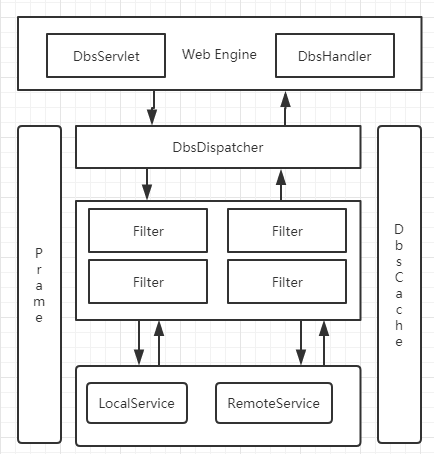

### Dbs组件

#### 1. 详细介绍
Dbs是一个开源的Web服务架构。每一种架构都是对普遍问题或特别问题的一种解决方案。Dbs可能要解决的是这样的一种特殊问题。

网站、客户端、接口　－－－》　业务层服务　－－－》　数据层服务

主要解决业务层及数据层的痛点，可能存在多种技术框架；业务层如何便捷地使用数据层服务，业务层之间的模块之间如何实现服务共享，

现有的解决方案提供服务注册中心，业务层服务、数据层服务都注册上去；业务层与数据层之间通过ＲＰＣ的方式进行数据交换。

如果业务层与数据层之间通信要穿越网段、机房、防火墙，那注册中心就是个问题？

Dbs的解决方案则是数据层向业务层模块进行注册、业务层如果存在多个模块，各位模块相互注册，则彼此之间可以相互使用服务，就像使用本地服务一样。


#### 2. 架构




#### 3. 快速入门

- maven依赖配置

```xml
<dependency>
	<groupId>com.jarveis</groupId>
	<artifactId>jvsframe-dbs</artifactId>
	<version>3.1.0</version>
</dependency>
```

- 编写服务类

```java
@Function(code="10001")
public class EchoHello implements Service {

    public Param callService(Param in) {
        Param out = null;
        try {
            out = new Param(Param.RESP);
            String name = in.getBody().getString("@name");
    
            out.getBody().setProperty("@message", "Hello " + name);
            out.getHead().setProperty(Param.LABEL_ERROR, Param.ERROR_SUCCESS);
        } catch (Exception ex) {
            if ( out != null ) {
                out.getHead().setProperty(Param.LABEL_ERROR, Param.ERROR_EXCEPTION);
            }
        }
        return out;
    }
}
```

- 编写启动类

```java
@DbsApplication(scanPackage="com.xxx.xxx, com.xxx.xxx")
@DbsServer(httpPort = 8000)
public class Main {
	public static void main(String[] args) {
		Application.run(Main.class, args);
	}
}
```

- 服务启动：

```shell
java com.jarveis.frame.example.Main
```

服务请求：
http://127.0.0.1:8000/dbs.service


#### 4. 核心部件-Filter

Filter是拦截业务的规则性组件，负责拦截业务请求。

系统提供的默认Filter

- 打印日志
  LoggerFilter( code=“logger” )
- 参数校验
  ParamFilter( code=“param” )
- IP拦截
  IpFilter( code=“ip” )
- 限流拦截
  LimitFilter( code=“limit” )
- 流量统计
  StatisticsFilter( code=“statistics” )

> 系统提供的默认拦截器,会自动加载到每个serives上. 用户在编写serivce时,不需要再进行配置.


##### 4.1 LoggerFilter 

LoggerFilter会在服务执行的过程中, 打印请求的日志和响应的日志. 便于技术人员进行问题的排查与处理.


##### 4.2 ParamFilter

ParamFilter会在服务执行的过程中, 校验请求的数据和响应的数据. 

1. 校验请求的服务编号是否符合规范, 框架对于服务的编号进行了强制性的约束. 服务编号只能是10000~99999之间的数值. 否则框架会认为服务编号不合法.
2. 校验请求的head参数是否存在xss攻击的行为
3. 校验服务响应的错误编码是否符合规范, 框架对于错误编码也进行了强制性约束. 错误编码只能是 1000~9999之间的数值. 否则框架会认为错误编码不合法.


##### 4.3 IpFilter

IpFilter会在服务执行的过程中, 校验请求的远程IP是否合法. 如果在dbs.xml中配置了dbs_ip_allow,  dbs_ip_deny这个两个参数中的任意一个, 框架会开启远程IP的拦截处理.

1. dbs_ip_allow: 表示允许访问的远程ip地址, 如果有多个ip地址, 请用","进行分隔.
2. dbs_ip_deny: 表示拒绝访问的远程ip地址, 如果有多个ip地址, 请用","进行分隔.

IpFilter提供了动态添加和删除白名单/黑名单IP的方法。

```java
@Function(code="10001")
public class EchoHello implements Service {

  public Param callService(Param in) {
    Param out = null;
    try {
      out = new Param(Param.RESP);
      String remoteIp = in.getHead().getString(Param.LABEL_REMOTEIP);

      // 添加白名单IP
      IpFilter.addAllowIp(remoteIp);
      // 删除白名单IP
      // IpFilter.removeAllowIp(remoteIp);
      // 添加黑名单IP
      // IpFilter.addDenyIp(remoteIp);
      // 删除黑名单IP
      // IpFilter.removeDenyIp(remoteIp);

      out.getBody().setProperty("@message", "Hello " + name);
      out.getHead().setProperty(Param.LABEL_ERROR, Param.ERROR_SUCCESS);
    } catch (Exception ex) {
      if ( out != null ) {
        out.getHead().setProperty(Param.LABEL_ERROR, Param.ERROR_EXCEPTION);
      }
    }
    return out;
  }
}
```


##### 4.4 LimitFilter

LimitFilter会在服务执行的过程中, 为了保证系统的稳定运行, 会对用户的请求进行相关的限流处理.  如果在dbs.xml中配置了dbs_limit_request, 框架会开启用户请求的限流处理.

1. dbs_limit_request: 表示系统并发的请求数. 当前系统只接受指定数量的请求, 多了就不处理了. 


##### 4.5 StatisticsFilter

StatisticsFilter会在服务执行的过程中, 统计用户的请求流量.

1. 统计每个服务的总请求
2. 统计每个服务的处理中的请求
3. 对服务的请求量，进行排序
4. 对处理中服务的请求量，进行排序


##### 4.6 自定义Filter

同时我们也可以实现满足自身业务的拦截器.

例如，我们要创建一个黑名单的拦截器，用户请求的名字如果是tom，则不通过；

首页创建Filter，需要实现Filter接口；并且声明拦截，便于业务服务进行使用 @Interceptor(code="拦截器的名称")；请注意声明的拦截名称一定要是唯一的。

```java
@Interceptor(code="black_name" )
public class BlackNameFilter implements Filter {

    public int init() {}
    public int destory() {}
    
    public int filter(Param param) {
        try {
            String name = in.getBody().getString("@name");
            if ("tom".equalsIgnoreCase(name)) {
                return 1001;
            }
        } catch (Exception ex) {
            logger.error(ex.getMessage(), ex);
        }
        return 0;
    }
}
```

第二步使用拦截器；框架考虑到拦截器的使用场景，拦截器需要在业务处理之前进行拦截处理；也需要在业务处理完之后进行拦截处理。

分别使用　@Before 对应前置拦截器； @After 对应后置拦截器。

一个服务的前（后）置拦截器可以配置多个，并且每个拦截器也会有相应的执行顺序；所以每个拦截器之前用","进行分隔，排在最前面的优先执行。

可以把前置拦截(1号拦截器,2号拦截器,3号拦截器...) -> 业务服务 -> 后置拦截(1号拦截器,2号拦截器,3号拦截器...)，执行顺序看成一个管道。

```java
@Function(code="10001")
@Before(filters="black_name")
public class EchoHello implements Service {

    public Param callService(Param in) {
        Param out = null;
        try {
            out = new Param(Param.RESP);
            String name = in.getBody().getString("@name");
    
            out.getBody().setProperty("@message", "Hello " + name);
            out.getHead().setProperty(Param.LABEL_ERROR, Param.ERROR_SUCCESS);
        } catch (Exception ex) {
            if ( out != null ) {
                out.getHead().setProperty(Param.LABEL_ERROR, Param.ERROR_EXCEPTION);
            }
        }
        return out;
    }
}
```

> 用户声明的拦截器名称一定要是唯一的，不要发生冲突


#### 5. 核心部件-Service

Service是业务服务组件，负责处理单个特定的业务请求。

首先创建Service，需要实现Service接口。并且声明服务请求地址，便于用户访问 @Function(code="请求服务编码")；请注意声明的服务编码一定要是唯一的。（服务编号只能是10000~99999之间的数值）

```java
@Function(code="10001")
public class EchoHello implements Service {

    public Param callService(Param in) { 
        Param out = null;
        try {
            out = new Param(Param.RESP);
            String name = in.getBody().getString("@name");
            
            out.getBody().setProperty("@message", "Hello " + name);
            out.getHead().setProperty(Param.LABEL_ERROR, Param.ERROR_SUCCESS);
        } catch (Exception ex) {
            if ( out != null ) {
                out.getHead().setProperty(Param.LABEL_ERROR, Param.ERROR_EXCEPTION);
            }
        }
        return out;
    }
}
```

框架默认为服务返回的数据类型是json格式和xml格式。

考虑到用户在使用过程中，需要返回html格式的数据；特别是第三方支付，可能会返回一个from表单式的html代码；框架通过CDATA的方式进行处理。如下：

```java
@Function(code="10002")
public class EchoHtml implements Service {
	
    public Param callService(Param in) { 
        Param out = null;
        try {
            out = new Param(Param.RESP);
            String name = in.getBody().getString("@name");
            
            out.getBody().addCDATA("Hello " + name);
            out.getHead().setProperty(Param.LABEL_ERROR, Param.ERROR_SUCCESS);
        } catch (Exception ex) {
            if ( out != null ) {
                out.getHead().setProperty(Param.LABEL_ERROR, Param.ERROR_EXCEPTION);
            }
        }
        return out;
    }
}
```

当然对于用户到底需要的是json、xml、html格式的数据，并不是业务服务进行决定的，而是由前端开发人员决定的；
所以业务服务就是尽其可能提供完善格式的数据，供前端用户进行选择性使用。

> 用户声明的服务编码一定要是唯一的，不要发生冲突


##### 5.1 服务的相互调用

在业务处理的过程中，会遇到多个服务之间的调用；而使用的服务有可能是本地的服务，也有可能是远程的服务。

Dbs框架在本地会有一个服务注册表，系统启动时会将本地的所有服务添加到注册表中，便于内部进行使用。如果本地服务器与远程注册中心进行连接，也可以把远程的注册服务拉到本地，那本地也就可以调用于远程服务了。

```
Param out = ServiceProxy.callService("服务编号", in);
```

对于业务调用者来说，并不关心调用的服务是本地服务还是远程服务；用户只需要关心本地注册表中有没有可用的服务。

```java
@Function(code="10002")
public class EchoHtml implements Service { 
    
    public Param callService(Param in) {
        Param out = null;
        try {
            out = new Param(Param.RESP);
            String name = in.getBody().getString("@name");
            
            Param subOut = ServiceProxy.callService("10003", in);
            if (Param.ERROR_SUCCESS.equals(subOut.getHead().getString(Param.LABEL_ERROR))) {
                out.getBody().addCDATA("Hello " + name);
                out.getHead().setProperty(Param.LABEL_ERROR, Param.ERROR_SUCCESS);
            } else {
                out.getHead().setProperty(Param.LABEL_ERROR, "3001");
            }
        } catch (Exception ex) {
            if ( out != null ) {
                out.getHead().setProperty(Param.LABEL_ERROR, Param.ERROR_EXCEPTION);
            }
        }
        return out;
    }
}

@Function(code="10003")
public class CheckName implements Service { 
    public Param callService(Param in) { 
        Param out = null;
        try { 
            out = new Param(Param.RESP);
            String name = in.getBody().getString("@name");
            
            if ("Tom".equals(name)){ 
                out.getHead().setProperty(Param.LABEL_ERROR, Param.ERROR_SUCCESS); 
            } else { 
                out.getHead().setProperty(Param.LABEL_ERROR, "3001"); 
            } 
        } catch (Exception ex) {
            if ( out != null ) {
                out.getHead().setProperty(Param.LABEL_ERROR, Param.ERROR_EXCEPTION);
            } 
        }
        return out; 
    }
}
```

> 服务在相互调用的过程中，拦截器的机制也有差异；
>
> * 本地服务在相互调用的过程中，是不会触发调用服务的拦截器的；
> * 远程服务的相互调用过程中，远程服务的拦截器是会被触发的。


##### 5.2 服务的作用域

服务功能的相互调用，会导致服务的相应抽象，比如有一个服务可以适配多个服务。同时也面临着另一个问题的产生，抽象的服务不想对外提供服务，仅限于本地内部服务的调用，此时我们引用了作用域的概念；

Dbs支持服务的作用域分为，public和private;

> * public作用域，定义了服务可以对外提供服务；内部的服务可以调用，外部的服务也可以调用．Dbs默认服务是public作用域．
> * private作用域，定义了服务可以对内提供服务；内部的服务可以调用，外部的服务不可以调用．

```java
@Function(code="10003", scope = Scope.PRIVATE)
public class CheckName implements Service { 
    public Param callService(Param in) { 
        Param out = null;
        try { 
            out = new Param(Param.RESP);
            String name = in.getBody().getString("@name");
            if ("Tom".equals(name)){
                out.getHead().setProperty(Param.LABEL_ERROR, Param.ERROR_SUCCESS); 
            } else { 
                out.getHead().setProperty(Param.LABEL_ERROR, "3001"); 
            } 
        } catch (Exception ex) { 
            if ( out != null ) { 
                out.getHead().setProperty(Param.LABEL_ERROR, Param.ERROR_EXCEPTION); 
            } 
        }
        return out; 
    }
}
```


##### 5.3 支持文件上传

```java
@Function(code="10004")
public class UploadService implements Service {

    public Param callService(Param in) {
        Param out = null;

        try {
            out = new Param(Param.RESP);

            String uploadPath = DbsCache.getConst("upload_folder");
            List<FileItem> formItems = DbsCache.getUploads();

            if (formItems != null && formItems.size() > 0) {
                // 迭代表单数据
                for (FileItem item : formItems) {
                    // 处理不在表单中的字段
                    if (!item.isFormField()) {
                        String fileName = new File(item.getName()).getName();
                        String filePath = uploadPath + File.separator + fileName;
                        File storeFile = new File(filePath);
                        // 保存文件到硬盘
                        item.write(storeFile);
                    }
                }
            }
            out.getHead().setProperty(Param.LABEL_ERROR, Param.ERROR_SUCCESS);
        } catch (Exception ex) {
            if (out != null) {
                out.getHead().setProperty(Param.LABEL_ERROR, Param.ERROR_EXCEPTION);
            }
        }

        return out;
    }

}
```

如果使用上传组件，dbs.xml需要增加如下配置：

```xml
<dbs>
    ...
    
    <constants>
        ...
        <constant name="upload_memory_size" value="3145728" />
        <constant name="upload_file_size" value="41943040" />
        <constant name="upload_request_size" value="52428800" />
        <constant name="upload_folder" value="D:\\tmp" />
        ...
    </constants>
    
    ...
</dbs>
```


##### 5.4 支持输入流

```java
@Function(code="10005")
public class UploadService implements Service {

    public Param callService(Param in) {
        Param out = null;

        try {
            out = new Param(Param.RESP);

            byte[] bytes = DbsCache.getStream();

            String str = new String(bytes);
            out.getHead().setProperty(Param.LABEL_ERROR, Param.ERROR_SUCCESS);
        } catch (Exception ex) {
            if (out != null) {
                out.getHead().setProperty(Param.LABEL_ERROR, Param.ERROR_EXCEPTION);
            }
        }

        return out;
    }

}
```

##### 5.5 支持HttpServletRequest

```java
@Function(code="10001")
public class EchoHello implements Service {

  public Param callService(Param in) {
    Param out = null;
    try {
      HttpServletRequest req = DbsUtils.getHttpRequest();
      Enumeration en = req.getHeaderNames();
      while (en.hasMoreElements()) {
        String key = (String) en.nextElement();
        String value = req.getHeader(key);
        System.out.println(key + ":" + value);
      }
      
      out = new Param(Param.RESP);
      String name = in.getBody().getString("@name");

      out.getBody().setProperty("@message", "Hello " + name);
      out.getHead().setProperty(Param.LABEL_ERROR, Param.ERROR_SUCCESS);
    } catch (Exception ex) {
      if ( out != null ) {
        out.getHead().setProperty(Param.LABEL_ERROR, Param.ERROR_EXCEPTION);
      }
    }
    return out;
  }
}
```

#### 6. 核心部件-Param

Param是输入和输出数据的标准对象，Dbs将接收到的输入参数封装成Param对象方便Dbs框架内的数据交换及处理，Dbs最终会将返回的Param对象，转换成用户需要的数据格式；

对于数据的输入与输出并没有作相同格式的限定，也就是说json的输入可得到(json|xml|html)格式的输出．同样对于xml的输入也可以得到(json|xml|html)格式的输出．输出的格式是按照在传入的返回数据格式来生成的．

输入支持
- 支持json数据格式；
- 支持xml数据格式；
- 支持参数形式传递；

输出支持
- 支持json数据格式；
- 支持xml数据格式；
- 支持html数据格式；


##### 6.1 json数据格式

输入和输出

```javascript
{
    "head": {
        "dataType": "返回数据格式",
        "device": "设备标识",
        "token": "会话标识",
        "funcId": "服务编号"
    },
    "body": {
        propKey: propValue,
        ...
    }
}
/* 实例-输入 */
{
    "head": {
        "dataType": "json",
        "device": "a7bf1feda8124fd7a15b302691ba164f",
        "token": "dbded8a69c9a41d4908a24f5c58ae419",
        "funcId": "10001"
    },
    "body": {
        name: "jvsframe"
    }
}
/* 实例-输出 */
{
    "head": {
        "dataType": "json",
        "device": "a7bf1feda8124fd7a15b302691ba164f",
        "token": "dbded8a69c9a41d4908a24f5c58ae419",
        "funcId": "10001"
    },
    "body": {
        message: "Hello jvsframe"
    }
}
```


##### **6.2 xml数据格式**

输入

```xml
<Req>
<head device="设备标识" token="会话标识" funcId="服务编号" dataType="返回数据格式" />
<body propKey="propValue" />
</Req>
```

实例 

```xml
<Req>
<head device="a7bf1feda8124fd7a15b302691ba164f" token="dbded8a69c9a41d4908a24f5c58ae419" funcId="10001" dataType="xml"/>
<body name="jvsframe" />
</Req>
```

输出

```xml
<?xml version="1.0" encoding="UTF-8"?>
<Resp>
<head device="设备标识" token="会话标识" funcId="服务编号" dataType="返回数据格式"/>
<body propKey="propValue">
    <extensibleNode proKey="propValue" /> 
</body>
</Resp>
```

实例

```xml
<Resp>
<head device="a7bf1feda8124fd7a15b302691ba164f" token="dbded8a69c9a41d4908a24f5c58ae419" funcId="10001" dataType="xml"/>
<body message="Hello jvsframe" />
</Resp>
```


##### 6.3 html数据格式

输入：使用json,xml的输入数据格式，定义dataType="html"

```xml
/* 实例－输入 */
{
    "head": {
        "dataType": "html",
        "device": "a7bf1feda8124fd7a15b302691ba164f",
        "token": "dbded8a69c9a41d4908a24f5c58ae419",
        "funcId": "10001"
    },
    "body": {
        name: "jvsframe"
    }
}
或
<Req>
<head device="a7bf1feda8124fd7a15b302691ba164f" token=“dbded8a69c9a41d4908a24f5c58ae419” funcId="10001" dataType="html"/>
<body name="jvsframe" />
</Req>
```

输出

```xml
<?xml version="1.0" encoding="UTF-8"?>
<Resp>
<head device="设备标识" token="会话标识" funcId="服务编号" dataType="返回数据格式"/>
<body>
    <![CDATA[
    (html code|javascript code)
    ]]> 
</body>
</Resp>
```

实例

```xml
<?xml version="1.0" encoding="UTF-8"?>
<Resp>
<head device="设备标识" token="会话标识" funcId="服务编号" dataType="返回数据格式"/>
<body>
    <![CDATA[
    <h1>Hello jvsframe</h1>
    ]]> 
</body>
</Resp>
```


##### 6.4 请求方式

为发方便前端多原化的请求方式，dbs支持提供了两种类型的请求方式．

- 统一分发请求
http://127.0.0.1:8080/dbs.service?_message=json格式

```html
http://127.0.0.1:8080/dbs.service?message={"head":{"device":"a7bf1feda8124fd7a15b302691ba164f","token":"dbded8a69c9a41d4908a24f5c58ae419","funcId":"10001","dataType":"json"},"body":{"name":"jvsframe"}}
```

http://127.0.0.1:8080/dbs.service?_message=xml格式

```html
http://127.0.0.1:8080/dbs.service?message=<Req><head device="a7bf1feda8124fd7a15b302691ba164f" token="dbded8a69c9a41d4908a24f5c58ae419" funcId="10001" dataType="xml"/><body name="jvsframe"/>
```

- 按服务请求
http://127.0.0.1:8080/10001.service?参数集

```html
http://127.0.0.1:8080/10001.service?_device=a7bf1feda8124fd7a15b302691ba164f&_token=dbded8a69c9a41d4908a24f5c58ae419&name=jvsframe
```

http://127.0.0.1:8080(/{渠道}/{版本号})/{返回数据格式}/10001.service?参数集

```html
http://127.0.0.1:8080/web/1.1/json/10001.service?name=jvsframe
```


#### 7. 配置

##### 7.1 常量

业务开发的过程中会使用到一些配置信息，Dbs提供了基于dbs.xml的配置处理．

```xml
<dbs>
    ...
    <constants>
        <constant name="配置名" value="配置值" />
    </constants>
    ...
</dbs>
```

如何获取配置数据，可以通过DbsCache.getConst("配置名"),方法来获取配置值．

```java
public class Demo { 
    public Param callService(Param in) { 
        Param out = null;
        try { 
            out = new Param(Param.RESP);
            String name = in.getBody().getString("@name");
            String whiteNames = DbsCache.getConst("white.list");
            if (whiteNames.indexOf(name)){ 
                out.getHead().setProperty(Param.LABEL_ERROR, Param.ERROR_SUCCESS); 
            } else { 
                out.getHead().setProperty(Param.LABEL_ERROR, "3001"); 
            } 
        } catch (Exception ex) { 
            if ( out != null ) { 
                out.getHead().setProperty(Param.LABEL_ERROR, Param.ERROR_EXCEPTION); 
            } 
        }
        return out; 
    }
}
```


##### 7.2 集群

在大型应用中，业务都是模块化的，对于模块与模块之间存在着彼此调用。Dbs提供了自己的服务注册中心，每个一个业务模块可以将自己的服务发布到注册中心，方便其它的模块进行调用。


A注册中心（dbs.xml），端口号:8001

```xml
<constants>
	<!-- dbs版本号 -->
	<constant name="dbs_version" value="3.0.2" />
	<!-- dbs节点编号 -->
	<constant name="dbs_machine" value="901" />
	<!-- dbs节点类型 -->
	<constant name="dbs_node" value="serviceServer" />
	<!-- dbs节点访问地址 -->
	<constant name="dbs_local" value="http://127.0.0.1:8001"/>
</constants>
```

B注册中心（dbs.xml），端口号:8002

```xml
<constants>
	<!-- dbs版本号 -->
	<constant name="dbs_version" value="3.0.2" />
	<!-- dbs节点编号 -->
	<constant name="dbs_machine" value="902" />
	<!-- dbs节点类型 -->
	<constant name="dbs_node" value="serviceServer" />
	<!-- dbs节点访问地址 -->
	<constant name="dbs_local" value="http://127.0.0.1:8002"/>
	
</constants>
```

C功能模块（dbs.xml），端口号:8003

```xml
<constants>
	<!-- dbs版本号 -->
	<constant name="dbs_version" value="3.0.2" />
	<!-- dbs节点编号 -->
	<constant name="dbs_machine" value="101" />
	<!-- dbs节点类型 -->
	<constant name="dbs_node" value="serviceNode" />
	<!-- dbs节点访问地址 -->
	<constant name="dbs_local" value="http://127.0.0.1:8003" />
	<!-- dbs注册中心地址 -->
	<constant name="dbs_name_server" value="http://127.0.0.1:8001,http://127.0.0.1:8002" />
	<!-- 订阅注册中心的服务(正则表达式) -->
	<constant name="dbs_subscribe" value="*" />
</constants>
```

D功能模块（dbs.xml），端口号:8004

```xml
<constants>
	<!-- dbs版本号 -->
	<constant name="dbs_version" value="3.0.2" />
	<!-- dbs节点编号 -->
	<constant name="dbs_machine" value="102" />
	<!-- dbs节点类型 -->
	<constant name="dbs_node" value="serviceNode" />
	<!-- dbs节点访问地址 -->
	<constant name="dbs_local" value="http://127.0.0.1:8004" />
	<!-- dbs注册中心地址 -->
	<constant name="dbs_name_server" value="http://127.0.0.1:8001,http://127.0.0.1:8002" />
	<!-- 订阅注册中心的服务(正则表达式) -->
	<constant name="dbs_subscribe" value="*" />
</constants>
```


##### 7.3 WebSocket

Dbs启动时开发人员可以跟据需要开启WebSocket服务，可以进行以下两种情况的配置：

1、启动类配置
```java
@DbsApplication
@DbsServer(httpPort = 8080)
public class Node8080 {

    public static void main(String[] args) {
        DbsCache.putConst(DbsConst.DBS_VERSION, "3.0.0");
        DbsCache.putConst(DbsConst.DBS_MACHINE, "003");
        DbsCache.putConst(DbsConst.DBS_NODE, "serviceNode");
        DbsCache.putConst(DbsConst.DBS_LOCAL, "http://127.0.0.1:8080");

        System.setProperty("dbs.wsEnable", "true");

        Application.run(Node8080.class, args);
    }
}
```

2、启动脚本配置
```shell
java -Ddbs.wsEnable=true com.jarveis.frame.dbs.jetty.Dbs4Jetty
```

WebSocket开启后，访问地址：ws://127.0.0.1/ws/

浏览器端测试用例如下：
```javascript
<script type="text/javascript">
    var messageTemplate = '{"head":{"device":"94929a5bf3fb4e83b63bfe9a4f3d31b8","token":"1514ad5374c946b3b81cb1f6df12ea44","funcId":"10001","dataType":"json"},"body":{"name":"$1"}}'

    if ("WebSocket" in window) {
      // 打开一个 web socket
      var ws = new WebSocket("ws://127.0.0.1:8080/ws/")

      // Connection opened
      ws.addEventListener('open', function (event) {
        sendMsg('Tom')
      })

      // Listen for messages
      ws.addEventListener('message', function (event) {
        alert(event.data)
      })

      ws.addEventListener('close', function (event) {
        alert(event)
      })
    } else {
      alert("您的浏览器不支持 WebSocket!")
    }

    function sendMsg (name) {
      if (!name) {
        name = 'Jerry' + parseInt(Math.random() * 100)
      }
      ws.send(messageTemplate.replace('$1', name))
    }
</script>
```


##### 7.4 优化

配置参数

dbs.contextPath = /
应用程序的上下文路径，默认的值（"/"）

dbs.staticPath = static
静态文件的存在路径，默认值（static）

dbs.httpPort = 8080
应用程序的端口号，默认值（8080）

dbs.poolSize = 500
应用程序的处理线程池大小，默认值（200）

dbs.acceptors = 1
应用程序用于接受用户请求的线程数，默认值（-1）

dbs.selectors = 2
应用程序用于解析用户请求的线程数，默认值（-1）

dbs.node = serviceNode
应用程序的节点类型

dbs.version = 3.0.2
应用程序的版本号

dbs.machine = 001
应用程序的机器编号

dbs.local = http://127.0.0.1:8080
应用程序的访问地址

dbs.wsEnable = false
应用程序是否开启websocket服务，默认值（false）；如果开启，websocket的地址为"ws://127.0.0.1:8080/ws/"

启动入口

```shell
java -Ddbs.contextPath=/test -Ddbs.httpPort=8080 -Ddbs.poolSize=200 com.jarveis.frame.dbs.jetty.Dbs4Jetty
```


#### 附录

> 由于框架使用的是Jetty容器，在生产应用中可能存在大数量的请求，造成系统异常。 默认情况下jetty限制了form提交数据的最大size和最大keys数，maxFormContentSize为200000，maxFormKeys为1000；可以通过如下设置改变默认设置：
> ```shell
> # 表单大小设置为5M
> # 表单的参数设置为2000个
> java -Ddbs.httpPort=8080 \
>      -Dorg.eclipse.jetty.server.Request.maxFormContentSize=5000000 \
>      -Dorg.eclipse.jetty.server.Request.maxFormKeys=2000 \
>      com.jarveis.frame.dbs.jetty.Dbs4Jetty
> ```

xss注入的测试数据
```html
_message=%7B%22head%22%3A%7B%22appId%22%3A%227008%22%2C%22appVersion%22%3A%222.1.2%22%2C%22device%22%3A%22<ScRiPt>alert(1)</ScRiPt>%22%2C%22token%22%3A%22%22%2C%22funcId%22%3A%2290001%22%2C%22dataType%22%3A%22json%22%7D%2C%22body%22%3A%7B%22phone%22%3A%2218888888888%22%2C%22typeflag%22%3A%225%22%7D%7D

_message=%7B%22body%22%3A%7B%22imgcode%22%3A%22%22%2C%22password%22%3A%229CDFEB19745E3896231B2C3D28F6FFB9%22%2C%22phone%22%3A%2212312312321%22%2C%22verifycode%22%3A%22%22%7D%2C%22head%22%3A%7B%22appId%22%3A%227008%22%2C%22appVersion%22%3A%222.1.3%22%2C%22dataType%22%3A%22json%22%2C%22device%22%3A%22ac78ffa25e1448d0af43f81af204b1a9%22%2C%22funcId%22%3A%22%5Cu003csCrIpT%5Cu003eipybqmogfy%5Cu003c%2FScRiPt%5Cu003e%22%2C%22token%22%3A%22%22%7D%7D

_message=%7B%22body%22%3A%7B%22phone%22%3A%2212312312321%22%2C%22typeflag%22%3A%225%22%7D%2C%22head%22%3A%7B%22appId%22%3A%227008%22%2C%22appVersion%22%3A%222.1.3%22%2C%22dataType%22%3A%22json%22%2C%22device%22%3A%22ac78ffa25e1448d0af43f81af204b1a9%22%2C%22funcId%22%3A%22%5Cu003csCrIpT%5Cu003ealert(1)%5Cu003c%2FsCrIpT%5Cu003e%22%2C%22token%22%3A%22%22%7D%7D

_message=%7B%22head%22%3A%7B%22appId%22%3A%22%3CScRiPt%3Ealert%281%29%3C%2FScRiPt%3E%22%2C%22appVersion%22%3A%22%3CScRiPt%3Ealert%281%29%3C%2FScRiPt%3E%22%2C%22device%22%3A%22%3CScRiPt%3Ealert%281%29%3C%2FScRiPt%3E%22%2C%22token%22%3A%22%3CScRiPt%3Ealert%281%29%3C%2FScRiPt%3E%22%2C%22funcId%22%3A%22%3CScRiPt%3Ealert%281%29%3C%2FScRiPt%3E%22%2C%22dataType%22%3A%22%3CScRiPt%3Ealert%281%29%3C%2FScRiPt%3E%22%7D%2C%22body%22%3A%7B%22phone%22%3A%2218888888888%22%2C%22typeflag%22%3A%225%22%7D%7D
```
