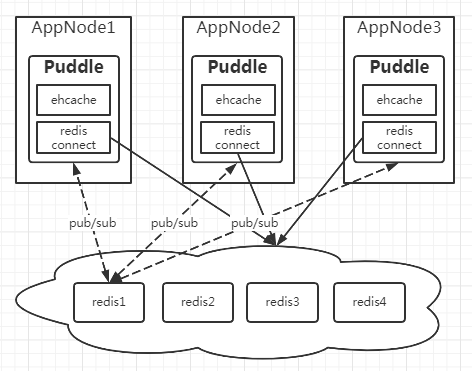

### Puddle组件
Puddle是基于ehcache+redis的二级缓存组件。

Puddle第一级（L1）缓存使用的是本地内存（ehcache），第二级（L2）缓存使用远程内存(redis)。

由于大量的缓存读取会使得L2的网络成为系统瓶颈，因此L1的存在是降低对L2的读取频次。

该组件主要用于集群，也可用于单机。

该组件可跟据需要，只用L1或L2。

#### 系统架构



#### 单机（L1-ehcache）配置

- maven依赖配置

```xml
<dependency>
    <groupId>com.jarveis</groupId>
    <artifactId>jvsframe-puddle</artifactId>
    <version>3.2.0</version>
</dependency>
```

- config.xml配置文件

系统增加缓存模块
```xml
<?xml version="1.0" encoding="utf-8"?>
<config>
    
    <module>
　　　　　...
        <parser clazz="com.jarveis.frame.cache.Puddle"/>
        ...
    </module>

    <puddleConfig>
        <puddle>
            <!-- 缓存等级：(1|2) -->
            <property name="level" value="1" />
            <!-- 缓存同步的广播机制: (redis | none) -->
            <property name="broadcast" value="none" />
            <!-- 一级缓存: (jvscache | ehcache | redis | none) -->
            <property name="l1_provider" value="ehcache" />
            <!-- 二级缓存: (jvscache | ehcache | redis | none)，如果缓存等级为1级，此设置无效 -->
            <property name="l2_provider" value="none" />
            <!-- 缓存对象的序列化方式: (fst | fst-snappy | fastjson | java) -->
            <property name="serialization" value="fst" />
        </puddle>
    </puddleConfig>
</config>
```

L1缓存ehcache的配置文件ehcache.xml
```xml
<ehcache updateCheck="false" dynamicConfig="false">
    <diskStore path="java.io.tmpdir" />

    <cacheManagerEventListenerFactory class="" properties="" />

    <defaultCache maxElementsInMemory="1000" eternal="false" timeToIdleSeconds="1800" timeToLiveSeconds="1800" overflowToDisk="true">
    </defaultCache>

    <cache name="session" maxElementsInMemory="10" eternal="false" timeToIdleSeconds="1800" timeToLiveSeconds="1800" overflowToDisk="false" />

</ehcache>
```

#### 单机（L1-redis）配置

- maven依赖配置

```xml
<dependency>
    <groupId>com.jarveis</groupId>
    <artifactId>jvsframe-puddle</artifactId>
    <version>3.2.0</version>
</dependency>
```

- config.xml配置文件

系统增加缓存模块
```xml
<?xml version="1.0" encoding="utf-8"?>
<config>
    
    <module>
　　　　　...
        <parser clazz="com.jarveis.frame.cache.Puddle"/>
        ...
    </module>

    <puddleConfig>
        <puddle>
            <!-- 缓存等级：(1|2) -->
            <property name="level" value="1" />
            <!-- 缓存同步的广播机制: (redis | none) -->
            <property name="broadcast" value="none" />
            <!-- 一级缓存: (jvscache | ehcache | redis | none) -->
            <property name="l1_provider" value="redis" />
            <!-- 二级缓存: (jvscache | ehcache | redis | none)，如果缓存等级为1级，此设置无效 -->
            <property name="l2_provider" value="none" />
            <!-- 缓存对象的序列化方式: (fst | fst-snappy | fastjson | java) -->
            <property name="serialization" value="fst" />
        </puddle>
    </puddleConfig>

    <redisConfig>
        <datasource mode="single">
            <property name="uri" value="reids://1qaz2wsx@192.168.1.100:6379" />
            <property name="timeout" value="20000" />
            <property name="maxTotal" value="1000" />
            <property name="maxIdle" value="20" />
            <property name="maxWait" value="10000" />
            <property name="testOnBorrow" value="true" />
            <property name="testOnReturn" value="true" />
            <property name="channel" value="j2cache_channel" />
        </datasource>
    </redisConfig>
</config>
```

#### 单机（L1-jvscache）配置

- maven依赖配置

```xml
<dependency>
    <groupId>com.jarveis</groupId>
    <artifactId>jvsframe-puddle</artifactId>
    <version>3.2.0</version>
</dependency>
```

- config.xml配置文件

系统增加缓存模块
```xml
<?xml version="1.0" encoding="utf-8"?>
<config>
    
    <module>
　　　　　...
        <parser clazz="com.jarveis.frame.cache.Puddle"/>
        ...
    </module>

    <puddleConfig>
        <puddle>
            <!-- 缓存等级：(1|2) -->
            <property name="level" value="1" />
            <!-- 缓存同步的广播机制: (redis | none) -->
            <property name="broadcast" value="none" />
            <!-- 一级缓存: (jvscache | ehcache | redis | none) -->
            <property name="l1_provider" value="jvscache" />
            <!-- 二级缓存: (jvscache | ehcache | redis | none)，如果缓存等级为1级，此设置无效 -->
            <property name="l2_provider" value="none" />
            <!-- 缓存对象的序列化方式: (fst | fst-snappy | fastjson | java) -->
            <property name="serialization" value="fst" />
        </puddle>
    </puddleConfig>

    <jvsCacheConfig>
        <datasource>
            <!-- 缓存持久化存储目录（默认值：%user.home%/.jvscache） -->
            <property name="disk" value="D:/jvscache" />
            <!-- 缓存最大容量(默认值：-1，不限制) -->
            <property name="maxSize" value="20000" />
        </datasource>
    </jvsCacheConfig>
</config>
```

#### 单机（L1 + L2)配置

- maven依赖配置

```xml
<dependency>
    <groupId>com.jarveis</groupId>
    <artifactId>jvsframe-puddle</artifactId>
    <version>3.2.0</version>
</dependency>
```

- config.xml配置文件

系统增加缓存模块
```xml
<?xml version="1.0" encoding="utf-8"?>
<config>
    
    <module>
　　　　　...
        <parser clazz="com.jarveis.frame.cache.Puddle"/>
        ...
    </module>

    <puddleConfig>
        <puddle>
            <!-- 缓存等级：(1|2) -->
            <property name="level" value="1" />
            <!-- 缓存同步的广播机制: (redis | none) -->
            <property name="broadcast" value="none" />
            <!-- 一级缓存: (jvscache | ehcache | redis | none) -->
            <property name="l1_provider" value="ehcache" />
            <!-- 二级缓存: (jvscache | ehcache | redis | none)，如果缓存等级为1级，此设置无效 -->
            <property name="l2_provider" value="redis" />
            <!-- 缓存对象的序列化方式: (fst | fst-snappy | fastjson | java) -->
            <property name="serialization" value="fst" />
        </puddle>
    </puddleConfig>
    
    <redisConfig>
        <datasource mode="single">
            <property name="uri" value="reids://1qaz2wsx@192.168.1.100:6379" />
            <property name="timeout" value="20000" />
            <property name="maxTotal" value="1000" />
            <property name="maxIdle" value="20" />
            <property name="maxWait" value="10000" />
            <property name="testOnBorrow" value="true" />
            <property name="testOnReturn" value="true" />
            <property name="channel" value="j2cache_channel" />
        </datasource>
    </redisConfig>

</config>
```

L1缓存ehcache的配置文件ehcache.xml
```xml
<ehcache updateCheck="false" dynamicConfig="false">
    <diskStore path="java.io.tmpdir" />

    <cacheManagerEventListenerFactory class="" properties="" />

    <defaultCache maxElementsInMemory="1000" eternal="false" timeToIdleSeconds="1800" timeToLiveSeconds="1800" overflowToDisk="true">
    </defaultCache>

    <cache name="session" maxElementsInMemory="10" eternal="false" timeToIdleSeconds="1800" timeToLiveSeconds="1800" overflowToDisk="false" />

</ehcache>
```

#### L1集群（L1 + L2)配置

- maven依赖配置

```xml
<dependency>
    <groupId>com.jarveis</groupId>
    <artifactId>jvsframe-puddle</artifactId>
    <version>3.2.0</version>
</dependency>
```

- config.xml配置文件

系统增加缓存模块
```xml
<?xml version="1.0" encoding="utf-8"?>
<config>
    
    <module>
　　　　　...
        <parser clazz="com.jarveis.frame.cache.Puddle"/>
        ...
    </module>

    <puddleConfig>
        <puddle>
            <!-- 缓存等级：(1|2) -->
            <property name="level" value="1" />
            <!-- 缓存同步的广播机制: (redis | none) -->
            <property name="broadcast" value="redis" />
            <!-- 一级缓存: (jvscache | ehcache | redis | none) -->
            <property name="l1_provider" value="ehcache" />
            <!-- 二级缓存: (jvscache | ehcache | redis | none)，如果缓存等级为1级，此设置无效 -->
            <property name="l2_provider" value="redis" />
            <!-- 缓存对象的序列化方式: (fst | fst-snappy | fastjson | java) -->
            <property name="serialization" value="fst" />
        </puddle>
    </puddleConfig>
    
    <redisConfig>
        <datasource mode="single">
            <property name="uri" value="reids://1qaz2wsx@192.168.1.100:6379" />
            <property name="timeout" value="20000" />
            <property name="maxTotal" value="1000" />
            <property name="maxIdle" value="20" />
            <property name="maxWait" value="10000" />
            <property name="testOnBorrow" value="true" />
            <property name="testOnReturn" value="true" />
            <property name="channel" value="j2cache_channel" />
        </datasource>
    </redisConfig>

</config>
```
L1缓存ehcache的配置文件ehcache.xml
```xml
<ehcache updateCheck="false" dynamicConfig="false">
    <diskStore path="java.io.tmpdir" />

    <cacheManagerEventListenerFactory class="" properties="" />

    <defaultCache maxElementsInMemory="1000" eternal="false" timeToIdleSeconds="1800" timeToLiveSeconds="1800" overflowToDisk="true">
    </defaultCache>

    <cache name="session" maxElementsInMemory="10" eternal="false" timeToIdleSeconds="1800" timeToLiveSeconds="1800" overflowToDisk="false" />

</ehcache>
```

#### L2集群（L1 + L2)配置

- maven依赖配置

```xml
<dependency>
    <groupId>com.jarveis</groupId>
    <artifactId>jvsframe-puddle</artifactId>
    <version>3.2.0</version>
</dependency>
```

- config.xml配置文件

系统增加缓存模块
```xml
<?xml version="1.0" encoding="utf-8"?>
<config>
    
    <module>
　　　　　...
        <parser clazz="com.jarveis.frame.cache.Puddle"/>
        ...
    </module>

    <puddleConfig>
        <puddle>
            <!-- 缓存等级：(1|2) -->
            <property name="level" value="1" />
            <!-- 缓存同步的广播机制: (redis | none) -->
            <property name="broadcast" value="redis" />
            <!-- 一级缓存: (jvscache | ehcache | redis | none) -->
            <property name="l1_provider" value="ehcache" />
            <!-- 二级缓存: (jvscache | ehcache | redis | none)，如果缓存等级为1级，此设置无效 -->
            <property name="l2_provider" value="redis" />
            <!-- 缓存对象的序列化方式: (fst | fst-snappy | fastjson | java) -->
            <property name="serialization" value="fst" />
        </puddle>
    </puddleConfig>
    
    <redisConfig>
        <datasource mode="cluster">
            <property name="uri" value="reids://shwebredis@192.168.1.100:9001,reids://shwebredis@192.168.1.100:9002,reids://shwebredis@192.168.1.100:9003,reids://shwebredis@192.168.1.100:9004,reids://shwebredis@192.168.1.100:9005,reids://shwebredis@192.168.1.100:9006" />
            <property name="timeout" value="20000" />
            <property name="maxTotal" value="1000" />
            <property name="maxIdle" value="20" />
            <property name="maxWait" value="10000" />
            <property name="testOnBorrow" value="true" />
            <property name="testOnReturn" value="true" />
            <property name="channel" value="j2cache_channel" />
        </datasource>
    </redisConfig>

</config>
```
L1缓存ehcache的配置文件ehcache.xml
```xml
<ehcache updateCheck="false" dynamicConfig="false">
    <diskStore path="java.io.tmpdir" />

    <cacheManagerEventListenerFactory class="" properties="" />

    <defaultCache maxElementsInMemory="1000" eternal="false" timeToIdleSeconds="1800" timeToLiveSeconds="1800" overflowToDisk="true">
    </defaultCache>

    <cache name="session" maxElementsInMemory="10" eternal="false" timeToIdleSeconds="1800" timeToLiveSeconds="1800" overflowToDisk="false" />

</ehcache>
```

#### 快速入门

```java
public class Demo {
    public static void main(String[] args){
        ApplicationConfig config = new ApplicationConfig();
        config.parse();

        CacheChannel cache = Puddle.getChannel();
        String region = "test";
        String key = "message";
        String value = "Hello World";
        // 添加缓存数据
        cache.put(region, key, value);
    
        // 获取缓存数据
        CacheObject obj = cache.get(region, key);
        System.out.printf("[%s,%s,L%d]=>%s\n", obj.getRegion(), obj.getKey(), obj.getLevel(),
        							obj.getValue());

        // 删除存数据
        cache.remove(region, key);

        // 添加缓存数据
        key = "language";
        cache.lpush(region, key, "java"); // 从左边添加
        cache.rpush(region, key, "c"); // 从右边添加
        cache.lpush(region, key, "c++");
        cache.lpush(region, key, "python");
        cache.lpush(region, key, "javascript");
        cache.lpush(region, key, "php");
        cache.lpush(region, key, "go");
        cache.lpush(region, key, "swift");
        
        // 从左边获取缓存数据
        CacheObject obj = cache.lpop(region, key);
        System.out.printf("[%s,%s,L%d]=>%s\n", obj.getRegion(), obj.getKey(), obj.getLevel(),
        							obj.getValue());
        
        // 从右边获取缓存数据
        CacheObject obj = cache.rpop(region, key);
        System.out.printf("[%s,%s,L%d]=>%s\n", obj.getRegion(), obj.getKey(), obj.getLevel(),
        							obj.getValue());
    
        // 获取缓存列表的长度
        CacheObject obj = cache.llen(region, key);
        System.out.printf("[%s,%s,L%d]=>%s\n", obj.getRegion(), obj.getKey(), obj.getLevel(),
        							obj.getValue());

        // 从左边获取2条缓存数据
        CacheObject obj = cache.lrange(region, key, 2);
        System.out.printf("[%s,%s,L%d]=>%s\n", obj.getRegion(), obj.getKey(), obj.getLevel(),
        							obj.getValue());
        
        // 从左边删除2条数据
        cache.lrem(region, key, 2);

        // 设置hash值
        String field = "java";
        String value = "1995";
        cache.hput(region, key, field, value);
    
        // 获取hast键的字段值
        CacheObject obj = cache.hget(region, key, field);
        System.out.printf("[%s,%s$%s,L%d]=>%s\n", obj.getRegion(), obj.getKey(), obj.getField(), obj.getLevel(),
        							obj.getValue());
        
        // 删除hash键的字段值
        cache.hrem(region, key, field);

    }
}
```