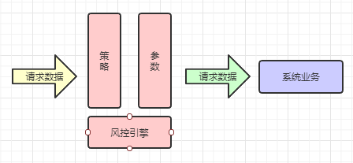

### Sluice组件
sluice是dbs服务的风控组件，支持动态添加风控策略，风控集群。帮助运营人员、开发人员及时调整线上业务运行策略。

slucice支持简单的表达式，同时还提供了扩展接口，方便开发人员增加复杂的风控算法。

#### 系统架构



#### 单机配置

- maven依赖配置

```xml
<dependency>
    <groupId>com.jarveis</groupId>
    <artifactId>jvsframe-sluice</artifactId>
    <version>3.0.1</version>
</dependency>
```

- config.xml配置文件

系统增加风控模块
```xml
<?xml version="1.0" encoding="utf-8"?>
<config>
    
    <module>
　　　　　...
        <parser clazz="com.jarveis.frame.dbs.DbsParser" />
        <parser clazz="com.jarveis.frame.sluice.SluiceParser"/>
        ...
    </module>
    
</config>
```

- dbs.xml配置文件

扫描并加载sluice包下的服务及拦截器。
```xml
<?xml version="1.0" encoding="utf-8"?>
<dbs timestamp="0">
    <constants>
        ...
        <constant name="dbs_scan_package" value="com.jarveis.frame.sluice" />
        ...
    </constants>
</dbs>
```

- sluice.xml配置文件

添加风控配置文件
```xml
<sluice timestamp="0">
    <policies>
        <!-- 休市  -->
        <policy funcId='10053'>
            <rule rank='before' exp='$matchDates(closeTime, $sysdate())' errcode='1001' priority='9' />
        </policy>
    </policies>
    
    <variables>
        <variable type="CONST" name="closeTime" value="00:00:00~23:59:59" />
        <variable type="HEAD" name="remoteIp" value="remoteIp" />
        <variable type="BODY" name="usercode" value="usercode" />
    </variables>
</sluice>
```

用例：
对10053的服务增加了风控配置，当系统时间在00:00:00~23:59:59时，返回1001的错误。


#### 集群配置

##### ServiceServer

- maven依赖配置

```xml
<dependency>
    <groupId>com.jarveis</groupId>
    <artifactId>jvsframe-sluice</artifactId>
    <version>3.0.0</version>
</dependency>
```

- config.xml配置文件

系统增加风控模块
```xml
<?xml version="1.0" encoding="utf-8"?>
<config>
    
    <module>
　　　　　...
        <parser clazz="com.jarveis.frame.dbs.DbsParser" />
        <parser clazz="com.jarveis.frame.sluice.SluiceParser"/>
        ...
    </module>
    
</config>
```

- dbs.xml配置文件

扫描并加载sluice包下的服务及拦截器。
```xml
<?xml version="1.0" encoding="utf-8"?>
<dbs timestamp="0">
    <constants>
        ...
        <constant name="dbs_scan_package" value="com.jarveis.frame.sluice" />
        <constant name="dbs_node" value="serviceServer" />
        <constant name="dbs_local" value="http://127.0.0.1:8000/dbs.service" />
        ...
    </constants>
</dbs>
```

- sluice.xml配置文件

添加风控配置文件
```xml
<sluice timestamp="0">
    <policies>
        <!-- 休市  -->
        <policy funcId='10053'>
            <rule rank='before' exp='$matchDates(closeTime, $sysdate())' errcode='1001' priority='9' />
        </policy>
    </policies>
    
    <variables>
        <variable type="CONST" name="closeTime" value="00:00:00~23:59:59" />
        <variable type="HEAD" name="remoteIp" value="remoteIp" />
        <variable type="BODY" name="usercode" value="usercode" />
    </variables>
</sluice>
```

用例：
对10053的服务增加了风控配置，当系统时间在00:00:00~23:59:59时，返回1001的错误。


##### ServiceNode

- maven依赖配置

```xml
<dependency>
    <groupId>com.jarveis</groupId>
    <artifactId>jvsframe-sluice</artifactId>
    <version>3.0.0</version>
</dependency>
```

- config.xml配置文件

系统增加风控模块
```xml
<?xml version="1.0" encoding="utf-8"?>
<config>
    
    <module>
　　　　　...
        <parser clazz="com.jarveis.frame.dbs.DbsParser" />
        <parser clazz="com.jarveis.frame.sluice.SluiceParser"/>
        ...
    </module>
    
</config>
```

- dbs.xml配置文件

扫描并加载sluice包下的服务及拦截器。
```xml
<?xml version="1.0" encoding="utf-8"?>
<dbs timestamp="0">
    <constants>
        ...
        <constant name="dbs_scan_package" value="com.jarveis.frame.sluice" />
        <constant name="dbs_node" value="serviceNode" />
        <constant name="dbs_local" value="http://127.0.0.1:8001/dbs.service" />
        <constant name="dbs_name_server" value="http://127.0.0.1:8000/dbs.service" />
        ...
    </constants>
</dbs>
```

- sluice.xml配置文件

添加风控配置文件
```xml
<sluice timestamp="0">
</sluice>
```

#### 系统函数

- boolean match(String regex, String str2), 给定的值是否匹配给定正则表达式
    - match("10053|10054|10055|10056", "10053") == true;
    - match("10053|10054|10055|10056", "10052") == false;

- boolean notMatch(String regex, String str2), 给定的值是否不匹配给定正则表达式
    - notMatch("10053|10054|10055|10056", "10053") == false;
    - notMatch("10053|10054|10055|10056", "10052") == true;
    
- String sysdate(), 返回当前系统时间,格式"yyyy-MM-dd HH:mm:ss"

- boolean matchDates(String regex, String date), 给定的时间是否匹配给定时间范围
    - matchDates("19:40:00~20:00:00", "19:45:00") == true
    - matchDates("19:40:00~20:00:00|21:00:00~22:00:00", "20:45:00") == false
    - matchDates("2019-02-04~2019-02-10", "2019-02-03") == false
    - matchDates("2019-02-04~2019-02-10", "2019-02-04") == true

- boolean notMatchDates(String regex, String date), 给定的时间是否不匹配给定时间范围
    - notMatchDates("19:40:00~20:00:00", "19:45:00") == false
    - notMatchDates("19:40:00~20:00:00|21:00:00~22:00:00", "20:45:00") == true
    - notMatchDates("2019-02-04~2019-02-10", "2019-02-03") == true
    - notMatchDates("2019-02-04~2019-02-10", "2019-02-04") == false

#### 自定义函数