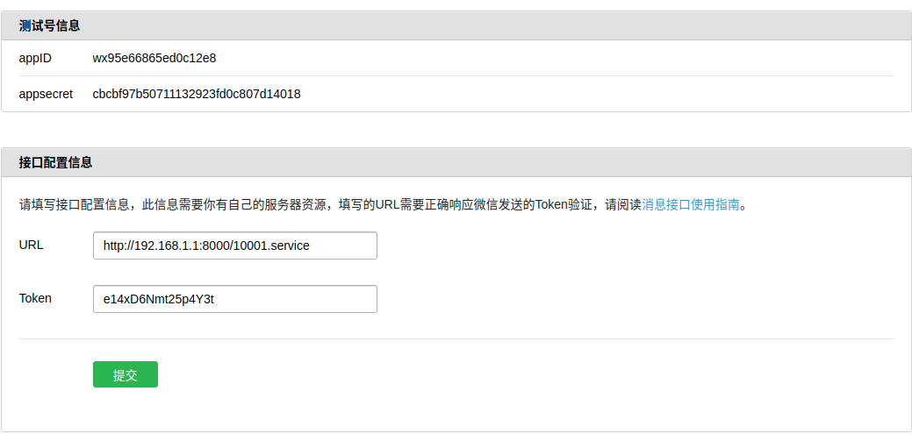

### Weixin组件

#### 1. 详细介绍

weixin组件，可以方便技术人员快速的接入到微信公众号平台，对其进行二次开发。在微信开发的过程中，技术人员不必关心与微信对接过程中的数据传输与格式化的问题； 技术人员只用关心自己的业务即可，做到开箱即用。


#### 2. 快速入门

- maven依赖配置

```xml
<dependency>
    <groupId>com.jarveis</groupId>
    <artifactId>jvsframe-weixin</artifactId>
    <version>3.1.0</version>
</dependency>
```


- config.xml配置文件

```xml
<?xml version="1.0" encoding="utf-8"?>
<config>
	<puddleConfig>
		<puddle>
			<!-- 缓存等级：(1|2) -->
			<property name="level" value="1" />
			<!-- 缓存同步的广播机制: (redis | none) -->
			<property name="broadcast" value="ehcache" />
			<!-- 一级缓存: (ehcache | redis | none) -->
			<property name="l1_provider" value="redis" />
			<!-- 二级缓存: (ehcache | redis | none)，如果缓存等级为1级，此设置无效 -->
			<property name="l2_provider" value="none" />
			<!-- 缓存对象的序列化方式: (fst | fst-snappy | fastjson | java) -->
			<property name="serialization" value="fst" />
		</puddle>
	</puddleConfig>
    
</config>
```


- ehcache.xml配置文件

```xml
<?xml version="1.0" encoding="utf-8"?>
<ehcache updateCheck="false" dynamicConfig="false">

	<diskStore path="java.io.tmpdir" />

	<cacheManagerEventListenerFactory class="" properties="" />

	<defaultCache maxElementsInMemory="1000" eternal="false"
		timeToIdleSeconds="1800" timeToLiveSeconds="1800"
		overflowToDisk="true">
	</defaultCache>

</ehcache>
```


- weixin.xml配置文件

```xml
<?xml version="1.0" encoding="UTF-8" ?>
<weixin>

    <constants>
        <constant name="appid" value="wx95e66865ed0c12e8" />
        <constant name="secret" value="cbcbf97b50711132923fd0c807d14018" />
        <constant name="token" value="e14xD6Nmt25p4Y3t" />
    </constants>

    <keywords>
        <keyword name="" value="" />
    </keywords>

</weixin>
```

请参考以下截图：




- 编写服务类

```java
@Function(code = "10001")
public class WeixinMainService implements WeixinService {
	
}
```


- 编写启动类

```java
@DbsApplication
@DbsServer(httpPort = 8000)
public class HttpServer {

    public static void main(String[] args) {
        Application.run(HttpServer.class, args);
    }
}

```


- 启动服务

```shell
java com.jarveis.frame.example.HttpServer
```


> 关于服务类与启动类的编写可以参考 jvsframe-dbs 相关的文档，会比此处解释的很详细。


#### 3. 核心组件-Router

技术人员在开发的过程中，可能需要对不同的消息类型进行处理；框架引入了路由器的概念，将不同的消息类型进行相关的路由配置，交给对应的处理器进行处理。

微信消息类型如下：

| 消息类型                  | 说明       |
| ------------------------- | ---------- |
| text                      | 文本消息   |
| image                     | 图片消息   |
| voice                     | 语音消息   |
| video                     | 视频消息   |
| shortvide                 | 短视频消息 |
| location                  | 位置消息   |
| link                      | 链接消息   |
| event                     | 事件消息   |
| news                      | 图文消息   |
| mpnews                    | 图文消息   |
| wxcard                    | 卡券消息   |
| miniprogrampage           | 小程序消息 |
| transfer_customer_service | 转发到客服 |

如何对这些消息进行路由处理？

技术人员需要在编写WexinService时将路由配置加入即可。如下：

```java
@Function(code = "10001")
public class WeixinMainService implements WeixinService {

	/**
     * 初始化路由器
     */
    protected void initRouter() {
        weixinRouter.rule().setMsgType(WeixinMsgType.TEXT).setWeixinHandler(new KeywordHandler()).end();
        weixinRouter.rule().setMsgType(WeixinMsgType.EVENT).setWeixinHandler(new EventHandler()).end();
    }
    
}
```

通过以上，可以每个路由规则都对应了一个处理器。这些处理器就是我们的第二核心组件。


#### 4. 核心组件-Handler

每个路由规则，都需要有对应的处理器，来进行相应的功能处理。为了便于技术人员的使用，框提供了几个简单的Handler。如下：

- KeywordHandler（关键字处理器）
- EventHandler（事件处理器）
- TransferCustomHandler（转客服处理器）


##### 4.1 KeywordHandler

在使用关键字处理器时，需要在weixin.xml中进行关键字的配置

```xml
<?xml version="1.0" encoding="UTF-8" ?>
<weixin>

    <constants>
        <constant name="appid" value="wx95e66865ed0c12e8" />
        <constant name="secret" value="cbcbf97b50711132923fd0c807d14018" />
        <constant name="token" value="e14xD6Nmt25p4Y3t" />
    </constants>

    <keywords>
        <keyword name="李白" value="李白（701年5月19日－762年11月30日），字太白，号青莲居士，中国唐朝诗人。有“诗仙”、“诗侠”、“酒仙”、“谪仙人”等称呼，活跃于盛唐，为杰出的浪漫主义诗人。" />
        <keyword name="杜甫" value="杜甫（712年2月12日－770年），字子美，号少陵野老，一号杜陵野客、杜陵布衣，唐朝现实主义诗人，其著作以弘大的社会写实著称。" />
        <keyword name="将进酒" value="file:///home/test/data/将进酒.txt" />
        <keyword name="天气" value="http://127.0.0.1:8001/20001.service" />
    </keywords>

</weixin>
```

当用户在前端输入关键字信息后，处理器会找到对应的关键字的值信息反馈给用户。

keywork配置节点中的value支持三种类型：

| 数据类型            | 说明                                                         |
| ------------------- | ------------------------------------------------------------ |
| 字符串              | 字符串原始返回                                               |
| 文件（file://）     | 读取文件中的数据进行返回                                     |
| http请求（http://） | 调用http请求，将执行结果返回；在请求的过程中会将微信的输入信息，以参数的方式传递给http请求。参数如下：<br />ToUserName、FromUserName、CreateTime、MsgId、Content、Bizmsgmenuid |


##### 4.2 EventHandler

事件处理器，主要于微信在推送事件消息后，系统对于这些事件消息进行统一的处理；返回success。


##### 4.3 TransferCustomHandler

转客服处理器，用于将收到的消息转给客服处理。客服可以在 https://mpkf.weixin.qq.com/ 后台与用户进行沟通及处理。


##### 4.4 自定义处理器

而对于其它的场景，比如说用户在公众号聊天窗口发送的文字消息，系统后收到这个文字消息后，需要进行相应的处理后，给用户一个反馈；这时就需要技术人员跟据自身的业务需要来进行相应的Handler编写。

```java
public class CustomHandler implements WeixinHandler {

    private static final Logger logger = Logger.getLogger(TransferCustomHandler.class);

    @Override
    public OutputMessage execute(InputMessage inputMessage) {
        TextOutputMessage om = new TextOutputMessage();
        TextInputMessage im = (TextInputMessage) inputMessage;
        
        String content = im.getContent();
		if ("兑换券".equals(content)){
            om.setContent(String.valueOf((int)(Math.random()*100000000)));
        }

        WeixinUtils.setOutputMessage(im, om);

        return om;
    }

}
```

